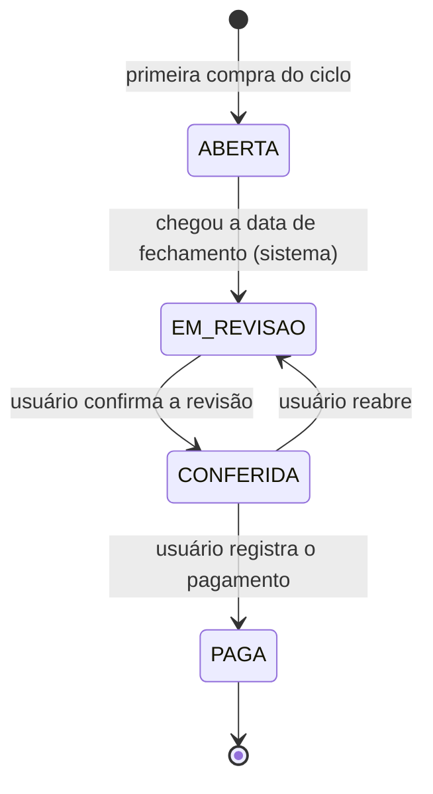
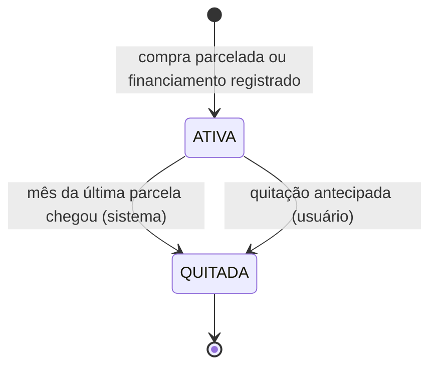
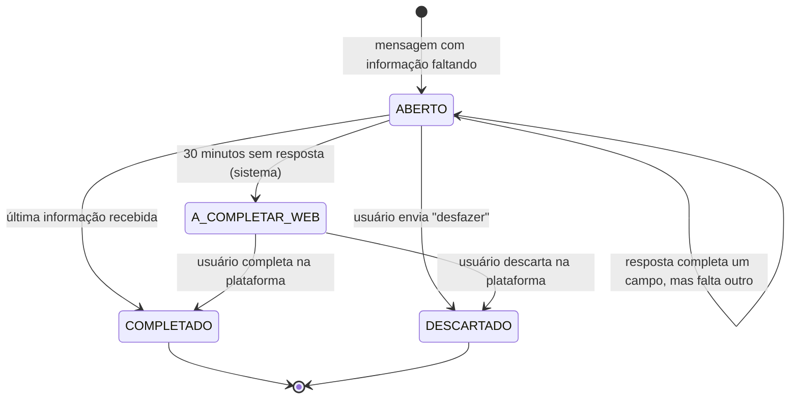
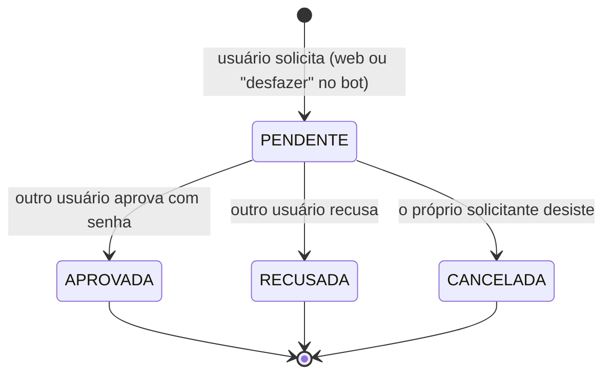

# Máquinas de Estado

| Campo | Valor |
|---|---|
| Base | ERS v1.2, `modelo-dados.md` |
| Situação | **Completo** — fatura, dívida, rascunho e solicitação de aprovação aprovadas |

Uma máquina de estados define, para uma entidade com ciclo de vida: os **estados** possíveis, as **transições** permitidas, os **eventos** que as disparam, as **guardas** (condições) e os **efeitos**. Toda transição que não está no diagrama é **proibida**: o código deve lançar uma exceção em vez de gravar um estado inconsistente.

Princípio para transições disparadas pelo sistema (agendador): devem ser **idempotentes**. Como o notebook pode estar desligado na data prevista, o agendador processa ao iniciar tudo o que estiver atrasado, e uma segunda execução não produz efeito adicional.

---

## 1. Fatura (RF14, RF15, RN06)

| Transição | Evento | Guarda | Efeito |
|---|---|---|---|
| — → ABERTA | Primeira compra cujo cálculo (RN03) aponta para esta fatura | Não existe fatura do cartão no mês de referência | Fatura criada com datas de fechamento, vencimento nominal e efetivo |
| ABERTA → EM_REVISAO | Agendador (origem SISTEMA) | Data atual ≥ data de fechamento | Aviso de revisão na tela inicial e na próxima resposta do bot |
| EM_REVISAO → CONFERIDA | Usuário confirma | — (a diferença em relação ao total do banco é exibida, mas não impede) | Compras da fatura travadas (RN06) |
| CONFERIDA → EM_REVISAO | Usuário reabre | — (sem validação cruzada, conforme RN07) | Compras destravadas |
| CONFERIDA → PAGA | Usuário registra o pagamento | — | Estado final |

| Estado | Compras da fatura |
|---|---|
| ABERTA | Podem ser adicionadas e alteradas |
| EM_REVISAO | Podem ser adicionadas (processamento tardio do banco), alteradas e movidas entre faturas |
| CONFERIDA | Travadas |
| PAGA | Travadas, sem possibilidade de reabertura |

Compra recebida pelo bot para uma fatura CONFERIDA ou PAGA: nada é gravado; o bot informa que a fatura está fechada e orienta a reabertura na plataforma.

---

## 2. Dívida (RF12)

| Transição | Evento | Guarda | Efeito |
|---|---|---|---|
| — → ATIVA | Registro da dívida (web ou bot com `Nx`) | — | Parcelas geradas como lançamentos nos meses correspondentes |
| ATIVA → QUITADA (normal) | Agendador (origem SISTEMA) | Mês atual ≥ mês de referência da última parcela | `data_quitacao` preenchida |
| ATIVA → QUITADA (antecipada) | Usuário registra a quitação, com valor e data | — | 1. Lançamento de quitação (categoria Dívidas, mês atual), referenciado em `lancamento_quitacao_id`; 2. exclusão lógica das parcelas com mês de referência futuro; 3. `data_quitacao` preenchida |

**Quitação antecipada sem validação cruzada.** A exclusão protegida pela RN07 serve para corrigir erros; a quitação é um acontecimento real que torna as parcelas futuras desnecessárias. O pagamento de quitação fica visível como lançamento, e o Envers registra o autor e as parcelas canceladas. Os três efeitos ocorrem numa única transação: ou todos são gravados, ou nenhum.

---

## 3. Rascunho (ERS 4.4)

| Transição | Evento | Guarda | Efeito |
|---|---|---|---|
| — → ABERTO | Mensagem sem "para quem" ou com categoria desconhecida | Remetente não tem outro rascunho ABERTO | Bot faz a pergunta do campo pendente |
| ABERTO → ABERTO | Resposta válida | Ainda falta um campo | `dados_parciais` e `campo_pendente` atualizados; próxima pergunta |
| ABERTO → COMPLETADO | Resposta válida | Nenhum campo falta | Lançamento criado na mesma transação; confirmação enviada |
| ABERTO → A_COMPLETAR_WEB | Prazo de 30 minutos esgotado | — | Aviso na tela inicial e na próxima resposta do bot |
| ABERTO → DESCARTADO | Comando `desfazer` | — | Nenhum lançamento criado |
| A_COMPLETAR_WEB → COMPLETADO | Usuário completa na web | Campos obrigatórios preenchidos | Lançamento criado na mesma transação |
| A_COMPLETAR_WEB → DESCARTADO | Usuário descarta na web | — | Nenhum lançamento criado |

**Descartar não exige validação cruzada:** um rascunho ainda não é um lançamento.

**Verificação do prazo em dois pontos:** o agendador faz a varredura periódica e, ao chegar uma nova mensagem do remetente, o prazo do rascunho dele é verificado antes do processamento. A regra de tempo não depende só do agendador estar em dia.

---

## 4. Solicitação de aprovação (RF10, RF07.1, RN07)

| Transição | Evento | Guarda | Efeito |
|---|---|---|---|
| — → PENDENTE | Pedido de exclusão (web ou `desfazer` sem rascunho aberto) ou cadastro de número | Sem outra solicitação pendente para o alvo; na exclusão, a fatura do lançamento não está CONFERIDA nem PAGA | Aviso ao outro usuário na tela inicial e na próxima resposta do bot |
| PENDENTE → APROVADA | Aprovação na web | Aprovador ≠ solicitante; senha confirmada (reautenticação); guarda da fatura **verificada novamente** | Exclusão: `excluido_em` do lançamento preenchido. Número: status APROVADO. Mesma transação |
| PENDENTE → RECUSADA | Recusa na web | Aprovador ≠ solicitante | Nenhum efeito sobre o alvo |
| PENDENTE → CANCELADA | Cancelamento na web | Quem cancela é o solicitante | Nenhum efeito sobre o alvo |

**Cancelar não enfraquece os quatro olhos:** só a aprovação produz efeito sobre os dados, e ela continua exigindo outra pessoa.

**Guarda verificada duas vezes:** entre a criação e a aprovação, a fatura do lançamento pode ter sido conferida. A verificação na aprovação impede uma condição de corrida em que o estado mudou entre a pergunta e a resposta.

---

## Histórico

| Data | Alteração |
|---|---|
| 05/10/2026 | Máquinas da fatura e da dívida aprovadas (quitação antecipada sem validação cruzada) |
| 05/10/2026 | Máquinas do rascunho (com DESCARTADO) e da solicitação de aprovação (com CANCELADA) aprovadas; ERS v1.2 |
