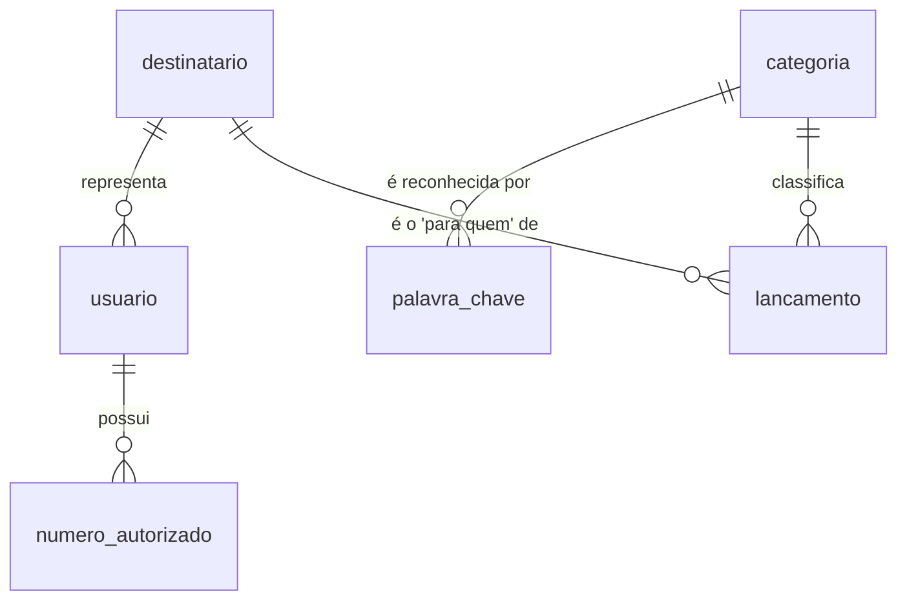
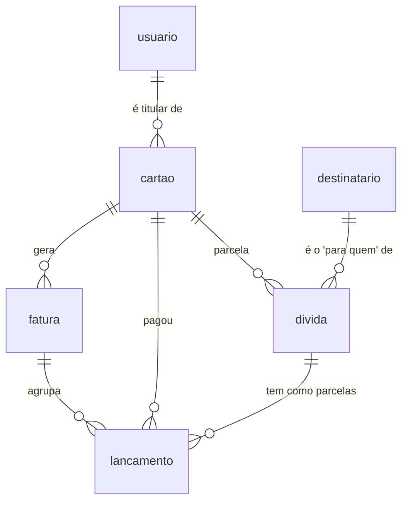
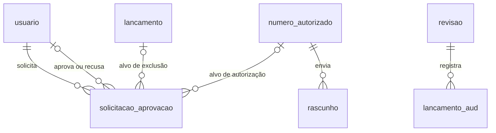
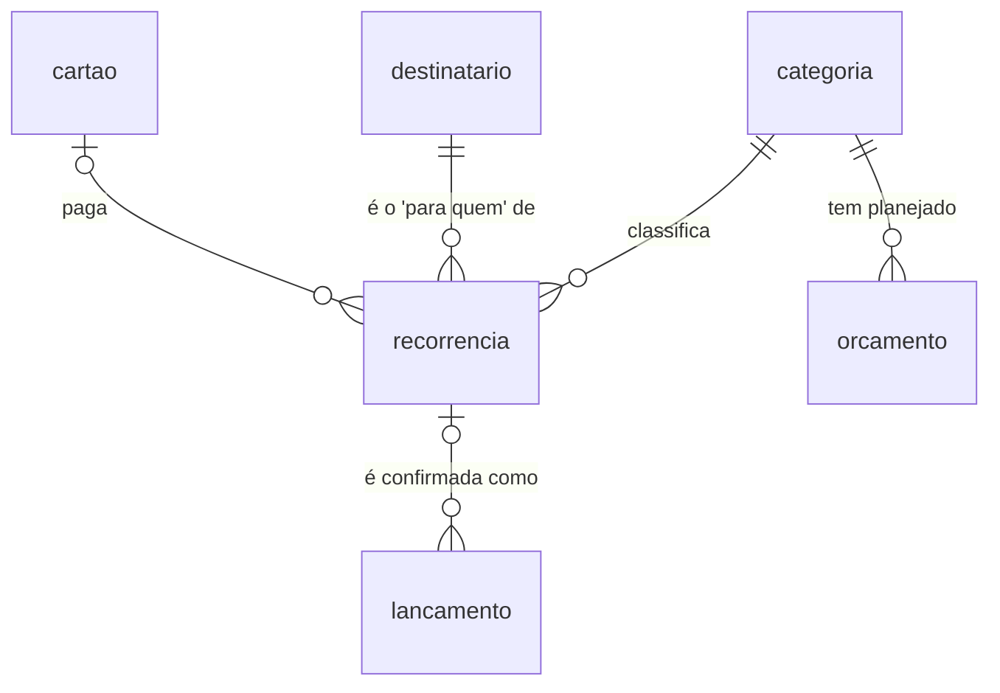
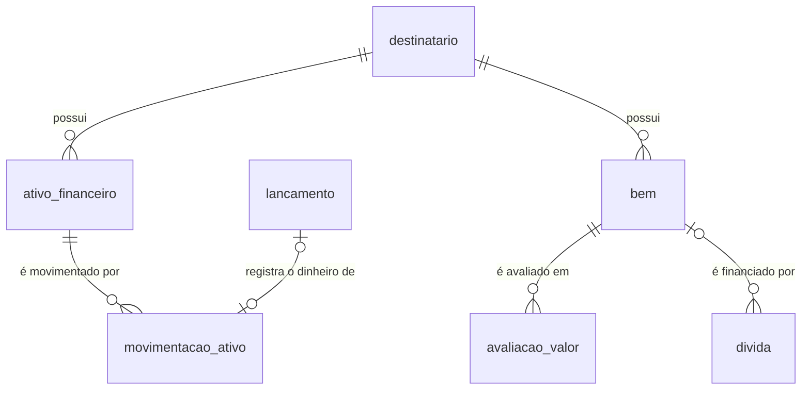

# Modelo de Dados Físico

| Campo | Valor |
|---|---|
| Banco | MySQL 8 |
| Base | ERS v1.2 (seção 7 — modelo conceitual), ADR-004, ADR-005, ADR-006 |
| Situação | **Completo** — blocos A a E aprovados (base: ERS v1.2) |

O modelo é dividido em três blocos:
- **A — Núcleo de lançamentos:** destinatários, usuários, números autorizados, categorias, palavras-chave e lançamentos.
- **B — Cartões, faturas e dívidas.**
- **C — Aprovações, rascunhos e auditoria.**
- **D — Planejamento:** recorrências, orçamento e metas.
- **E — Patrimônio:** ativos financeiros, cotações, bens e avaliações.

---

## 1. Convenções (válidas para todas as tabelas)

| ID | Convenção | Motivo |
|---|---|---|
| C1 | Nomes em português, `snake_case`; tabelas no singular | Coerência com as entidades Java (`Lancamento` → `lancamento`); o Spring converte `mesReferencia` → `mes_referencia` |
| C2 | Chave primária `id BIGINT AUTO_INCREMENT` | Um único banco gera os registros; menor e mais rápida que UUID nos índices |
| C3 | Charset `utf8mb4`, collation `utf8mb4_0900_ai_ci` | O `utf8` do MySQL não aceita emojis (presentes nas mensagens do bot); `ai_ci` ignora acentos e maiúsculas nas comparações |
| C4 | Dinheiro em `DECIMAL(12,2)`, sempre positivo (`CHECK (valor > 0)`) | O sentido vem da coluna `tipo`; elimina a ambiguidade de valores negativos (ADR-005) |
| C5 | `DATE` para datas; mês de referência como `DATE` com dia 1 (`CHECK (DAY(col) = 1)`); momentos de auditoria em `DATETIME(3)` UTC | Permite funções de data e ordenação; evita o `TIMESTAMP` (conversão implícita de fuso e limite em 2038) |
| C6 | Valores fixos como `VARCHAR` + `CHECK`; em Java, `enum` gravado pelo nome (`EnumType.STRING`) | Gravar a posição do `enum` muda o significado dos dados se a ordem mudar |
| C7 | Colunas padrão: `criado_em`, `criado_por`, `atualizado_em`, `atualizado_por` (auditoria automática do Spring Data JPA) e `versao` (concorrência otimista) | Atende ao RNF06; impede que uma edição sobrescreva outra feita ao mesmo tempo |
| C8 | Sem tabela de domicílio | O sistema atende a um único domicílio (YAGNI) |

Tipos Java correspondentes:

| MySQL | Java |
|---|---|
| `DECIMAL(12,2)` | `BigDecimal` |
| `DATE` | `LocalDate` |
| `DATE` (dia 1) | `YearMonth`, com `AttributeConverter` |
| `DATETIME(3)` | `Instant` |
| `VARCHAR` + `CHECK` | `enum` |

> As colunas padrão da C7 estão implícitas em todas as tabelas abaixo e não são repetidas.

---

## 2. Bloco A — Núcleo de lançamentos

### 2.1 Diagrama



### 2.2 `destinatario`
A quem um lançamento se destina ("para quem", RF13).

| Coluna | Tipo | Regras |
|---|---|---|
| id | BIGINT | PK |
| nome | VARCHAR(50) | NOT NULL, UNIQUE |
| marcacao_bot | VARCHAR(20) | NOT NULL, UNIQUE (ex.: `@mt`, `@jo`, `@casa`) |
| ativo | BOOLEAN | NOT NULL, padrão TRUE |

Tabela (e não `enum`) para que um novo membro da família seja apenas uma nova linha.

### 2.3 `usuario`

| Coluna | Tipo | Regras |
|---|---|---|
| id | BIGINT | PK |
| nome | VARCHAR(100) | NOT NULL |
| login | VARCHAR(50) | NOT NULL, UNIQUE |
| senha_hash | VARCHAR(255) | NOT NULL; hash do Spring Security (a senha nunca é gravada) |
| destinatario_id | BIGINT | NOT NULL, FK → destinatario |

### 2.4 `numero_autorizado` (RF07.1, RN07)

| Coluna | Tipo | Regras |
|---|---|---|
| id | BIGINT | PK |
| usuario_id | BIGINT | NOT NULL, FK → usuario |
| numero | VARCHAR(20) | NOT NULL, UNIQUE, formato internacional E.164 (`+5564999999999`) |
| status | VARCHAR(20) | NOT NULL, `CHECK IN ('PENDENTE','APROVADO')` |

O número de telefone é texto: não é uma quantidade, e o `+` inicial seria perdido num tipo numérico.

### 2.5 `categoria` (RF02)

| Coluna | Tipo | Regras |
|---|---|---|
| id | BIGINT | PK |
| nome | VARCHAR(50) | NOT NULL |
| tipo | VARCHAR(10) | NOT NULL, `CHECK IN ('RECEITA','DESPESA')` |
| ativa | BOOLEAN | NOT NULL, padrão TRUE |

Restrição: `UNIQUE (nome, tipo)`. Categorias são desativadas, nunca excluídas.

### 2.6 `palavra_chave` (RF02)

| Coluna | Tipo | Regras |
|---|---|---|
| id | BIGINT | PK |
| texto | VARCHAR(50) | NOT NULL, UNIQUE |
| categoria_id | BIGINT | NOT NULL, FK → categoria |

Pela collation (C3), `farmacia` e `Farmácia` são a mesma palavra-chave.

### 2.7 `lancamento` (RF01)

| Coluna | Tipo | Regras |
|---|---|---|
| id | BIGINT | PK |
| tipo | VARCHAR(10) | NOT NULL, `CHECK IN ('RECEITA','DESPESA')` |
| valor | DECIMAL(12,2) | NOT NULL, `CHECK (valor > 0)` |
| descricao | VARCHAR(200) | NOT NULL |
| categoria_id | BIGINT | NOT NULL, FK → categoria |
| destinatario_id | BIGINT | NOT NULL, FK → destinatario (RF13) |
| data_compra | DATE | NOT NULL |
| mes_referencia | DATE | NOT NULL, `CHECK (DAY(mes_referencia) = 1)` |
| origem | VARCHAR(15) | NOT NULL, `CHECK IN ('WEB','BOT','IMPORTACAO')` |
| mensagem_original | TEXT | Preenchida quando `origem = 'BOT'` |
| revisar | BOOLEAN | NOT NULL, padrão FALSE (RF15) |
| excluido_em | DATETIME(3) | NULL = ativo; preenchido = excluído logicamente (ADR-006) |

Colunas de ligação com cartões, faturas e dívidas: definidas no bloco B.

Índices:
- `idx_lancamento_mes (mes_referencia)` — resumo mensal.
- `idx_lancamento_categoria_mes (categoria_id, mes_referencia)` — planejado × real por categoria.

---

## 3. Bloco B — Cartões, faturas e dívidas

### 3.1 Diferença em relação ao modelo conceitual
As entidades conceituais `CompraParcelada` e `Divida` foram **unificadas na tabela `divida`**, distinguidas pela coluna `tipo`. Ambas têm a mesma estrutura (valor total, quantidade de parcelas, parcelas mensais na categoria Dívidas); a única diferença é a presença de um cartão. A unificação evita duas tabelas e duas lógicas de geração de parcelas quase idênticas.

### 3.2 Diagrama



### 3.3 `cartao` (RF14)

| Coluna | Tipo | Regras |
|---|---|---|
| id | BIGINT | PK |
| apelido | VARCHAR(20) | NOT NULL, UNIQUE (palavra usada no bot) |
| nome | VARCHAR(50) | NOT NULL |
| titular_id | BIGINT | NOT NULL, FK → usuario |
| dia_fechamento | TINYINT | NOT NULL, `CHECK BETWEEN 1 AND 31` |
| dia_vencimento | TINYINT | NOT NULL, `CHECK BETWEEN 1 AND 31` |
| compra_no_fechamento | VARCHAR(10) | NOT NULL, `CHECK IN ('ATUAL','PROXIMA')` |
| ativo | BOOLEAN | NOT NULL, padrão TRUE (cartão cancelado é desativado) |

Regra garantida na aplicação (não no banco): o apelido não pode coincidir com uma `palavra_chave.texto` nem com uma `destinatario.marcacao_bot`, pois são tabelas diferentes e o `UNIQUE` só atua dentro de uma tabela. Exige teste dedicado.

### 3.4 `fatura` (RF14, RF15)

| Coluna | Tipo | Regras |
|---|---|---|
| id | BIGINT | PK |
| cartao_id | BIGINT | NOT NULL, FK → cartao |
| mes_referencia | DATE | NOT NULL, dia 1 |
| data_fechamento | DATE | NOT NULL; editável na revisão |
| data_vencimento | DATE | NOT NULL; vencimento nominal |
| data_vencimento_efetiva | DATE | NOT NULL; próximo dia útil (RF16) |
| status | VARCHAR(15) | NOT NULL, `CHECK IN ('ABERTA','EM_REVISAO','CONFERIDA','PAGA')` |
| total_informado_banco | DECIMAL(12,2) | NULL até a revisão |

Restrição: `UNIQUE (cartao_id, mes_referencia)` — uma fatura por cartão por mês. Também protege contra a condição de corrida em que dois lançamentos simultâneos tentam criar a mesma fatura: só um consegue; o outro trata o erro reutilizando a fatura criada.

### 3.5 `divida` (RF12)

| Coluna | Tipo | Regras |
|---|---|---|
| id | BIGINT | PK |
| tipo | VARCHAR(20) | NOT NULL, `CHECK IN ('PARCELAMENTO_CARTAO','FINANCIAMENTO','EMPRESTIMO')` |
| descricao | VARCHAR(200) | NOT NULL |
| valor_total | DECIMAL(12,2) | NOT NULL, `CHECK (valor_total > 0)` |
| quantidade_parcelas | SMALLINT | NOT NULL, `CHECK (quantidade_parcelas >= 2)` |
| cartao_id | BIGINT | FK → cartao |
| destinatario_id | BIGINT | NOT NULL, FK → destinatario |
| data_contratacao | DATE | NOT NULL |
| status | VARCHAR(10) | NOT NULL, `CHECK IN ('ATIVA','QUITADA')` |
| bem_id | BIGINT | FK → bem (bloco E), opcional |
| data_quitacao | DATE | Preenchida quando a dívida é quitada |
| lancamento_quitacao_id | BIGINT | FK → lancamento, UNIQUE; só na quitação antecipada |

Restrições:
- `CHECK (tipo <> 'PARCELAMENTO_CARTAO' OR cartao_id IS NOT NULL)` — parcelamento de cartão exige o cartão.
- `CHECK ((status = 'QUITADA') = (data_quitacao IS NOT NULL))`.
- `CHECK (lancamento_quitacao_id IS NULL OR status = 'QUITADA')`.

O pagamento de quitação antecipada não é uma parcela numerada; por isso é ligado à dívida por `lancamento_quitacao_id`, e não pelo par `divida_id` + `numero_parcela` (ver `maquinas-estado.md`, seção 2).

O **saldo devedor não é gravado**: é calculado a partir das parcelas ainda não vencidas. Gravar um dado derivado criaria duas fontes da mesma informação, que poderiam divergir (normalização).

Sobre o valor das parcelas (ADR-005): quando o usuário informa o valor da parcela (bot: `16x 106,18`), o total é a multiplicação exata; quando informa o total (web), a divisão segue o arredondamento do ADR-005, com a diferença na primeira parcela.

### 3.6 `feriado` (RF16)

| Coluna | Tipo | Regras |
|---|---|---|
| id | BIGINT | PK |
| data | DATE | NOT NULL, UNIQUE |
| descricao | VARCHAR(100) | NOT NULL |
| abrangencia | VARCHAR(10) | NOT NULL, `CHECK IN ('NACIONAL','LOCAL')` |

### 3.7 Novas colunas em `lancamento`

| Coluna | Tipo | Regras |
|---|---|---|
| cartao_id | BIGINT | FK → cartao |
| fatura_id | BIGINT | FK → fatura |
| divida_id | BIGINT | FK → divida |
| numero_parcela | SMALLINT | `CHECK (numero_parcela >= 1)` |

Restrições:
- `CHECK ((divida_id IS NULL) = (numero_parcela IS NULL))` — ambos nulos ou ambos preenchidos.
- `CHECK (fatura_id IS NULL OR cartao_id IS NOT NULL)` — fatura exige cartão.
- `UNIQUE (divida_id, numero_parcela)` — não existem duas parcelas com o mesmo número na mesma dívida.

**Redundância consciente:** para compras no cartão, `lancamento.mes_referencia` deve ser igual a `fatura.mes_referencia`. A duplicação é deliberada (lançamentos sem cartão precisam do campo, e os relatórios consultam uma única tabela). A aplicação garante que os dois mudam juntos, por exemplo ao mover uma compra entre faturas na revisão. Exige teste dedicado.

### 3.8 Quitação antecipada
Definida em `maquinas-estado.md` (seção 2): não exige validação cruzada; as parcelas futuras são excluídas logicamente como efeito da quitação.

## 4. Bloco C — Aprovações, rascunhos e auditoria

### 4.1 Diagrama



### 4.2 `solicitacao_aprovacao` (RF10, RF07.1, RN07)

| Coluna | Tipo | Regras |
|---|---|---|
| id | BIGINT | PK |
| acao | VARCHAR(30) | NOT NULL, `CHECK IN ('EXCLUIR_LANCAMENTO','AUTORIZAR_NUMERO')` |
| lancamento_id | BIGINT | FK → lancamento |
| numero_autorizado_id | BIGINT | FK → numero_autorizado |
| solicitante_id | BIGINT | NOT NULL, FK → usuario |
| aprovador_id | BIGINT | FK → usuario; nulo até a decisão |
| status | VARCHAR(10) | NOT NULL, `CHECK IN ('PENDENTE','APROVADA','RECUSADA','CANCELADA')` |
| origem | VARCHAR(5) | NOT NULL, `CHECK IN ('WEB','BOT')` |
| decidida_em | DATETIME(3) | Nulo até a decisão ou o cancelamento |
| chave_pendente | VARCHAR(25) | **Coluna gerada** (ver abaixo), UNIQUE |

Restrições:
- **Alvo coerente com a ação:** `CHECK ((acao = 'EXCLUIR_LANCAMENTO' AND lancamento_id IS NOT NULL AND numero_autorizado_id IS NULL) OR (acao = 'AUTORIZAR_NUMERO' AND numero_autorizado_id IS NOT NULL AND lancamento_id IS NULL))`.
- **Quatro olhos no banco:** `CHECK (aprovador_id IS NULL OR aprovador_id <> solicitante_id)`. Duplica deliberadamente a verificação do serviço Java (defesa em profundidade).
- **Coerência do status:**
  ```sql
  CHECK (
    (status = 'PENDENTE'  AND aprovador_id IS NULL     AND decidida_em IS NULL) OR
    (status IN ('APROVADA','RECUSADA') AND aprovador_id IS NOT NULL AND decidida_em IS NOT NULL) OR
    (status = 'CANCELADA' AND aprovador_id IS NULL     AND decidida_em IS NOT NULL))
  ```
  No cancelamento, `decidida_em` registra o momento em que o solicitante desistiu.
- **Único entre os pendentes:** o MySQL não tem índice único parcial. A coluna gerada resolve:
  ```sql
  chave_pendente VARCHAR(25) AS (
    CASE WHEN status = 'PENDENTE'
         THEN COALESCE(CONCAT('L', lancamento_id), CONCAT('N', numero_autorizado_id))
    END) STORED UNIQUE
  ```
  Solicitações decididas têm `chave_pendente` nula, e o `UNIQUE` aceita vários nulos.

**Por que duas chaves estrangeiras, e não uma associação polimórfica** (`entidade` + `registro_id`): uma coluna que pode apontar para qualquer tabela não pode ser chave estrangeira, e o banco deixaria de garantir que o alvo existe. Como a RN07 é uma lista fechada de duas ações, as duas chaves estrangeiras reais são viáveis e mais seguras.

### 4.3 `rascunho` (ERS, seção 4.4)

| Coluna | Tipo | Regras |
|---|---|---|
| id | BIGINT | PK |
| numero_autorizado_id | BIGINT | NOT NULL, FK → numero_autorizado (remetente) |
| mensagem_original | TEXT | NOT NULL |
| dados_parciais | JSON | NOT NULL; o que o interpretador já reconheceu |
| campo_pendente | VARCHAR(15) | NOT NULL, `CHECK IN ('DESTINATARIO','CATEGORIA')` |
| status | VARCHAR(20) | NOT NULL, `CHECK IN ('ABERTO','COMPLETADO','A_COMPLETAR_WEB','DESCARTADO')` |
| remetente_aberto | BIGINT | **Coluna gerada**: `numero_autorizado_id` quando `status = 'ABERTO'`, nula nos demais; UNIQUE (um rascunho aberto por remetente) |

O prazo de 30 minutos não é gravado: é calculado a partir de `criado_em` e de uma configuração da aplicação.

**Por que JSON aqui:** o rascunho é temporário, parcial por definição e nunca consultado por campo interno. Ao ser completado, vira um `lancamento` com colunas e restrições normais.

### 4.4 `mensagem_processada` (idempotência do contrato gateway → core)

| Coluna | Tipo | Regras |
|---|---|---|
| mensagem_id | VARCHAR(100) | PK (identificador da mensagem no WhatsApp) |
| numero_autorizado_id | BIGINT | NOT NULL, FK → numero_autorizado |
| resposta | TEXT | NOT NULL; resposta enviada no primeiro processamento |
| processada_em | DATETIME(3) | NOT NULL, UTC |

Exceção à C2: a chave primária é o identificador natural da mensagem, pois é exatamente ele que precisa ser único. Exceção à C7: tabela técnica, sem colunas de auditoria nem `versao`. Registros antigos podem ser removidos periodicamente (ex.: após 90 dias), pois reentregas só ocorrem em prazos curtos.

### 4.5 Auditoria com Hibernate Envers (RNF06)

As colunas da C7 guardam apenas a última alteração. O histórico completo é mantido pelo **Hibernate Envers**, módulo oficial do Hibernate: a cada gravação de uma entidade marcada com `@Audited`, uma cópia da linha é salva numa tabela `<tabela>_aud`, ligada a uma revisão.

**`revisao`** (entidade de revisão personalizada, substitui a `REVINFO` padrão do Envers)

| Coluna | Tipo | Regras |
|---|---|---|
| id | BIGINT | PK |
| momento | DATETIME(3) | NOT NULL, UTC |
| usuario_id | BIGINT | FK → usuario; o autor (no bot, o dono do número remetente) |
| origem | VARCHAR(15) | NOT NULL, `CHECK IN ('WEB','BOT','IMPORTACAO','SISTEMA')` |

**Tabelas `_aud`:** mesmas colunas da tabela original, mais `rev` (FK → revisao) e `revtype` (0 = criação, 1 = alteração, 2 = remoção). São criadas pelas migrações do Flyway, não automaticamente.

**Entidades auditadas:** `lancamento`, `categoria`, `palavra_chave`, `cartao`, `fatura`, `divida`, `numero_autorizado`, `destinatario`, `solicitacao_aprovacao`.

A origem `SISTEMA` cobre gravações automáticas, como a atualização de status de faturas pelo agendador.

## 5. Bloco D — Planejamento

### 5.1 Diagrama



### 5.2 `recorrencia` (RF03)

| Coluna | Tipo | Regras |
|---|---|---|
| id | BIGINT | PK |
| tipo | VARCHAR(10) | NOT NULL, `CHECK IN ('RECEITA','DESPESA')` |
| descricao | VARCHAR(200) | NOT NULL |
| valor_estimado | DECIMAL(12,2) | NOT NULL, `CHECK (valor_estimado > 0)` |
| categoria_id | BIGINT | NOT NULL, FK → categoria |
| destinatario_id | BIGINT | NOT NULL, FK → destinatario |
| cartao_id | BIGINT | FK → cartao, opcional |
| periodicidade | VARCHAR(10) | NOT NULL, `CHECK IN ('MENSAL','ANUAL')` |
| dia_previsto | TINYINT | NOT NULL, `CHECK BETWEEN 1 AND 31` |
| mes_previsto | TINYINT | `CHECK BETWEEN 1 AND 12` |
| inicio | DATE | NOT NULL |
| fim | DATE | NULL = sem prazo; `CHECK (fim IS NULL OR fim >= inicio)` |
| ativa | BOOLEAN | NOT NULL, padrão TRUE |

Restrição: `CHECK ((periodicidade = 'ANUAL') = (mes_previsto IS NOT NULL))`.

Nova coluna em `lancamento`: `recorrencia_id BIGINT` (FK → recorrencia), com `UNIQUE (recorrencia_id, mes_referencia)` — uma recorrência só pode ser confirmada uma vez por mês.

**Previstos são calculados, não gravados.** O previsto de um mês são as recorrências ativas naquele mês que ainda não têm lançamento com o seu `recorrencia_id`. Ao confirmar, nasce um lançamento comum com o valor real. Assim nenhum relatório precisa distinguir "previsto" de "efetivado" nos lançamentos.

### 5.3 `orcamento` (RF04)

| Coluna | Tipo | Regras |
|---|---|---|
| id | BIGINT | PK |
| categoria_id | BIGINT | NOT NULL, FK → categoria (receita ou despesa) |
| vigente_desde | DATE | NOT NULL, dia 1 |
| valor_planejado | DECIMAL(12,2) | NOT NULL, `CHECK (valor_planejado >= 0)` |

Restrição: `UNIQUE (categoria_id, vigente_desde)`.

**Dados com vigência:** o planejado de uma categoria num mês é a linha mais recente com `vigente_desde` menor ou igual ao mês. Uma mudança de orçamento é uma linha nova; os meses anteriores mantêm o valor que tinham.

**Independência das recorrências:** o planejado não soma as recorrências automaticamente. O sistema avisa quando as recorrências ativas de uma categoria ultrapassam o orçamento dela.

### 5.4 `meta_economia` (RF04)

| Coluna | Tipo | Regras |
|---|---|---|
| id | BIGINT | PK |
| vigente_desde | DATE | NOT NULL, dia 1, UNIQUE |
| percentual | DECIMAL(5,2) | NOT NULL, `CHECK BETWEEN 0 AND 100` |

Mesma lógica de vigência do orçamento.

### 5.5 `ajuste_reserva` (RF18)

| Coluna | Tipo | Regras |
|---|---|---|
| id | BIGINT | PK |
| data | DATE | NOT NULL |
| valor | DECIMAL(12,2) | NOT NULL, `CHECK (valor <> 0)`; **pode ser negativo** |
| motivo | VARCHAR(200) | NOT NULL (ex.: "saldo antes do sistema", "correção conforme extrato") |

A reserva **não é gravada**: reserva = soma dos ajustes + soma dos resultados (receitas − despesas) de todos os meses de referência até o mês atual. Lançamentos com mês de referência futuro ficam de fora até o mês deles chegar.

**Exceção à C4:** ajustes podem ser negativos, pois corrigem a reserva para baixo ou registram um saldo inicial negativo.

> *Histórico:* esta tabela substituiu a `saldo_inicial`, aprovada antes da mudança do ERS v1.1 (RF18). O saldo inicial de cada mês passou a ser a reserva no início do mês.

---

## 6. Bloco E — Patrimônio

### 6.1 Diagrama



### 6.2 Exceção à C4: precisão de quantidades e preços unitários
Quantidades de cripto (0,00034512 BTC) e preços unitários de algumas moedas (R$ 0,00001234) não cabem em `DECIMAL(12,2)`. Quantidades usam `DECIMAL(24,8)` e preços unitários `DECIMAL(20,8)` (8 casas, padrão do Bitcoin). O arredondamento para centavos ocorre apenas no valor total exibido e no lançamento financeiro.

### 6.3 `ativo_financeiro` (RF05)

| Coluna | Tipo | Regras |
|---|---|---|
| id | BIGINT | PK |
| tipo | VARCHAR(10) | NOT NULL, `CHECK IN ('ACAO','CRIPTO')` |
| codigo | VARCHAR(20) | NOT NULL (ex.: PETR4, BTC) |
| fonte_cotacao | VARCHAR(10) | NOT NULL, `CHECK IN ('BRAPI','COINGECKO')` |
| destinatario_id | BIGINT | NOT NULL, FK → destinatario |
| ativo | BOOLEAN | NOT NULL, padrão TRUE |

Restrição: `UNIQUE (codigo, destinatario_id)`.

A quantidade e o preço médio **não são gravados**: são calculados a partir de `movimentacao_ativo`, o que também permite saber a posição em qualquer data passada.

### 6.4 `movimentacao_ativo` (RF17)

| Coluna | Tipo | Regras |
|---|---|---|
| id | BIGINT | PK |
| ativo_financeiro_id | BIGINT | NOT NULL, FK → ativo_financeiro |
| tipo | VARCHAR(16) | NOT NULL, `CHECK IN ('COMPRA','VENDA','POSICAO_INICIAL')` |
| data | DATE | NOT NULL |
| quantidade | DECIMAL(24,8) | NOT NULL, `CHECK (quantidade > 0)` |
| preco_unitario | DECIMAL(20,8) | NOT NULL, `CHECK (preco_unitario > 0)` |
| lancamento_id | BIGINT | FK → lancamento, UNIQUE |

Restrição: `CHECK ((tipo = 'POSICAO_INICIAL') = (lancamento_id IS NULL))` — compras e vendas sempre têm o lançamento financeiro correspondente; a posição inicial nunca tem, pois o dinheiro não saiu no período controlado.

A aplicação garante que uma venda não ultrapasse a quantidade disponível na data (regra entre várias linhas, que o `CHECK` não alcança).

### 6.5 `cotacao` (RF05)

| Coluna | Tipo | Regras |
|---|---|---|
| id | BIGINT | PK |
| codigo | VARCHAR(20) | NOT NULL |
| fonte | VARCHAR(10) | NOT NULL |
| data | DATE | NOT NULL |
| preco | DECIMAL(20,8) | NOT NULL, `CHECK (preco > 0)` |
| atualizado_em | DATETIME(3) | NOT NULL; última atualização do dia |

Restrição: `UNIQUE (codigo, fonte, data)` — uma linha por ativo por dia; as consultas ao longo do dia atualizam a linha do dia. A cotação é por código, não por posição.

### 6.6 `bem` (RF05)

| Coluna | Tipo | Regras |
|---|---|---|
| id | BIGINT | PK |
| tipo | VARCHAR(10) | NOT NULL, `CHECK IN ('VEICULO','IMOVEL','OUTRO')` |
| descricao | VARCHAR(200) | NOT NULL |
| metodo_avaliacao | VARCHAR(15) | NOT NULL, `CHECK IN ('FIPE','MANUAL','DEPRECIACAO')` |
| codigo_fipe | VARCHAR(10) | Obrigatório se FIPE |
| ano_modelo | SMALLINT | Obrigatório se FIPE |
| valor_compra | DECIMAL(12,2) | `CHECK (valor_compra > 0)`; obrigatório se DEPRECIACAO |
| data_compra | DATE | Obrigatório se DEPRECIACAO |
| vida_util_meses | SMALLINT | `CHECK (vida_util_meses > 0)`; obrigatório se DEPRECIACAO |
| destinatario_id | BIGINT | NOT NULL, FK → destinatario |
| data_baixa | DATE | Preenchida na venda ou descarte; nula = bem pertence ao domicílio |

Restrições:
- `CHECK (metodo_avaliacao <> 'FIPE' OR (codigo_fipe IS NOT NULL AND ano_modelo IS NOT NULL))`
- `CHECK (metodo_avaliacao <> 'DEPRECIACAO' OR (valor_compra IS NOT NULL AND data_compra IS NOT NULL AND vida_util_meses IS NOT NULL))`

### 6.7 `avaliacao_valor` (RF05)

| Coluna | Tipo | Regras |
|---|---|---|
| id | BIGINT | PK |
| bem_id | BIGINT | NOT NULL, FK → bem |
| data | DATE | NOT NULL |
| valor | DECIMAL(12,2) | NOT NULL, `CHECK (valor >= 0)` |
| origem | VARCHAR(10) | NOT NULL, `CHECK IN ('FIPE','MANUAL')` |

Restrição: `UNIQUE (bem_id, data)`. Bens com depreciação não geram linhas: o valor é calculado.

### 6.8 Fechamento mensal de patrimônio: descartado
Chegou a ser proposta uma tabela de fechamento mensal (fotografia do patrimônio a cada mês), porque a quantidade de ativos não tinha histórico. Com `movimentacao_ativo`, a posição em qualquer data passa a ser calculável, assim como a reserva, as cotações diárias, as avaliações e as dívidas. A tabela foi descartada (YAGNI); se o cálculo da evolução patrimonial ficar lento, ela pode ser reintroduzida como otimização.

---

## Histórico

| Data | Alteração |
|---|---|
| 01/10/2026 | Convenções C1–C8 e bloco A aprovados |
| 04/10/2026 | Bloco B aprovado (cartões, faturas, dívidas unificadas, feriados) |
| 04/10/2026 | Bloco C aprovado (aprovações, rascunhos, auditoria com Hibernate Envers) |
| 04/10/2026 | Bloco D aprovado (recorrências projetadas, orçamento e meta com vigência, saldo inicial) |
| 04/10/2026 | ERS v1.1: `saldo_inicial` substituída por `ajuste_reserva`; bloco E aprovado com `movimentacao_ativo` e quantidades calculadas; fechamento mensal descartado. Modelo completo |
| 05/10/2026 | `divida`: colunas `data_quitacao` e `lancamento_quitacao_id` (máquina de estados da dívida) |
| 05/10/2026 | Novos status: `CANCELADA` em `solicitacao_aprovacao` e `DESCARTADO` em `rascunho` (máquinas de estado; ERS v1.2) |
| 05/10/2026 | Nova tabela `mensagem_processada` (idempotência do contrato gateway → core) |
