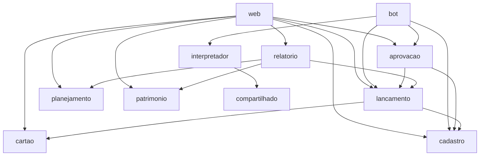

# Organização em Módulos (core)

| Campo | Valor |
|---|---|
| Base | ADR-002, ADR-004, `interpretador.md` |
| Situação | Aprovado |

## 1. Princípio: pacotes por funcionalidade

O código Java é organizado por funcionalidade, não por camada técnica. Cada pacote reúne entidade, repositório, serviço e regras de um assunto. Classes internas (repositórios, entidades, auxiliares) ficam **sem o modificador `public`**, visíveis apenas dentro do pacote. Outros módulos acessam um módulo somente pelo seu serviço público.

## 2. Módulos

| Pacote (`com.marcotulio.financeiro.*`) | Responsabilidade |
|---|---|
| `compartilhado` | Tipos e utilidades comuns: dinheiro, conversor de `YearMonth`, revisão do Envers, exceções |
| `seguranca` | Spring Security, login, reautenticação, validação do token do gateway |
| `cadastro` | Destinatários, usuários, números autorizados, categorias, palavras-chave |
| `interpretador` | Função pura de interpretação de mensagens (sem Spring, sem JPA) |
| `cartao` | Cartões, faturas, `CalculadoraFatura`, feriados |
| `lancamento` | Lançamentos e dívidas |
| `aprovacao` | Solicitações de aprovação (validação cruzada) |
| `planejamento` | Recorrências, orçamento, meta de economia, ajustes de reserva |
| `patrimonio` | Ativos, movimentações, cotações, bens, avaliações |
| `bot` | Endpoint interno, idempotência, rascunhos, montagem das respostas |
| `relatorio` | Consultas somente leitura: resumo mensal, planejado × real, reserva, patrimônio |
| `web` | Telas Thymeleaf + HTMX |

## 3. Dependências permitidas



Todos os módulos podem depender de `compartilhado`; `seguranca` é transversal (configuração do Spring).

## 4. Regras

| ID | Regra | Motivo |
|---|---|---|
| M1 | Sem ciclos entre módulos | Permite entender e alterar um módulo isoladamente |
| M2 | `interpretador` depende apenas de `compartilhado` e da biblioteca padrão Java | Mantém a função pura e testável |
| M3 | Nenhum módulo depende de `web` ou `bot` | São as cascas de entrada; o núcleo não as conhece |
| M4 | `relatorio` não altera dados | Relatórios são somente leitura |
| M5 | Acesso entre módulos apenas por serviços públicos | Ninguém grava dados de outro módulo contornando suas regras (ex.: a máquina de estados da fatura) |

Sobre o caso `aprovacao` → `lancamento`: a solicitação de exclusão é feita pelas cascas (`web`, `bot`) ao módulo `aprovacao`, que, na aprovação, executa a exclusão por meio do serviço de `lancamento`. O `lancamento` não conhece o `aprovacao`, evitando ciclo.

## 5. Verificação automática: ArchUnit

As regras M1 a M5 são verificadas por testes JUnit com a biblioteca **ArchUnit**, executados no pipeline. Uma violação reprova o build. Exemplo (M2):

```java
@Test
void interpretadorNaoDependeDeSpringNemDeBanco() {
    noClasses().that().resideInAPackage("..interpretador..")
        .should().dependOnClassesThat()
        .resideInAnyPackage("org.springframework..", "jakarta.persistence..")
        .check(classesImportadas);
}
```

Alternativa considerada: **Spring Modulith** (verificação de módulos, eventos e documentação gerada). Descartada nesta fase pela curva de aprendizado; pode substituir o ArchUnit no futuro.

## Histórico

| Data | Alteração |
|---|---|
| 08/10/2026 | Organização em módulos, regras M1–M5 e ArchUnit aprovados. Fim da fase de design |
